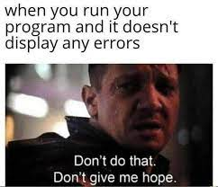

# Hello, folks!  I’m Shantanu a Software developer.
- 👀 I’m interested in creating technology to elevate people, and I'd like to share my knowledge with others. I am also passionate about AI and computer vision. 
- 👨‍💻 Some technologies I enjoy working with include Java, Python, Rest APIs, GraphQL.
- 🌱 I’m currently exploring cloud world and SRE principal.

- 💞️ I’m looking to collaborate on some open source project that line up with my interests.
- :speech_balloon: Let's talk about Tech, Traveling, Series, Memes.

- 📫 Find me on web 🌍

  [LinkedIn](https://www.linkedin.com/in/shantanu-481b761b6)

<!---
shantanukr/shantanukr is a ✨ special ✨ repository because its `README.md` (this file) appears on your GitHub profile.
You can click the Preview link to take a look at your changes.
--->
